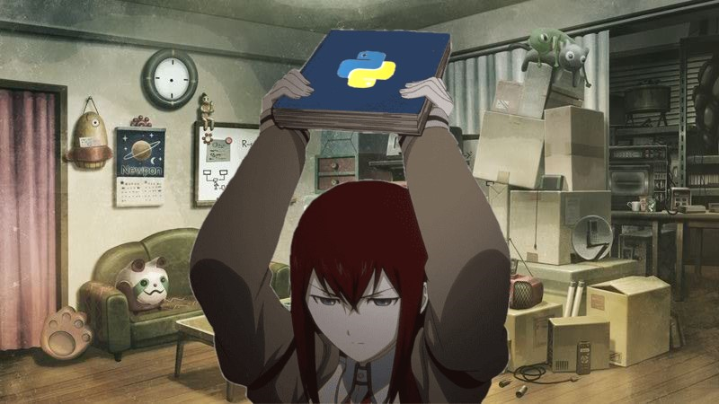

# My LaurieWired 2024 Halloween Programming Challenge Submission

I didn't have lots of time, so it's a bit crappy and simple, but that was a fun little challenge.

Happy Halloween!

## The script

[My Python Script](steins_gate_captcha.py) can be compiled with `pyinstaller --onefile --windowed steins_gate_captcha.py`.

The submission with the built binary and sourcecode can be found [in the releases section](https://github.com/JohnTitor2036/Halloween_2024_Programming_Challenge/releases/tag/v2036)

